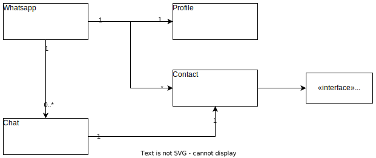

# Unit 0 - Introduction to Java & Object-Oriented Programming 

Please take a few minutes to read and understand the concepts to answer next questions

## Evaluation
[¿What is an object?](https://docs.oracle.com/javase/tutorial/java/concepts/object.html)

¿Which are the benefits of objects?

¿What it means that the object has "identity"?

¿What is a method?

¿What is signature method?

¿What is a parameter?

¿What are the pillars of the OOP?

¿Is there multiple inheritance in Java?

[¿What is a class?](https://docs.oracle.com/javase/tutorial/java/concepts/class.html)

[¿What is inheritance?](https://docs.oracle.com/javase/tutorial/java/concepts/inheritance.html)

[¿What is an interface?](https://docs.oracle.com/javase/tutorial/java/concepts/interface.html)

[¿What is a Package?](https://docs.oracle.com/javase/tutorial/java/concepts/package.html)


## Tasks

## Before you must consider
- The attributes and auxiliar methods must be defined by you
- Think the best way to do it
- Don't duplicate code

1. Implements the next UML class diagram



2. Write and implement next methods at *Whatsapp*
```java
public boolean changeProfileImage(String url)
public boolean changeProfileDisplayName(String newName)
public Optional<Contact> findContact(String name)
public Optional<Contact> blockContact(String name)
public boolean addContact(Contact aContact)
public List<Contact> listContacts()
public Optional<Contact> removeContact(Contact aContact)
public Optional<Chat> createChat(Contact aContact)
```

3. Write and implement the interface *Callable* as
```java
default void call() {
    /// TODO: Your code goes here
}
```

4. Create a Contact and show by console writing an Application class with
```java
public static void main(String[] args) {
    Contact contact = Contact.builder()
            .name("Robert")
            .number("+1955511235")
            .pic("https://imgur.com/gallery/91sn32Q")
            .build();

    System.out.println(contact);
}
```